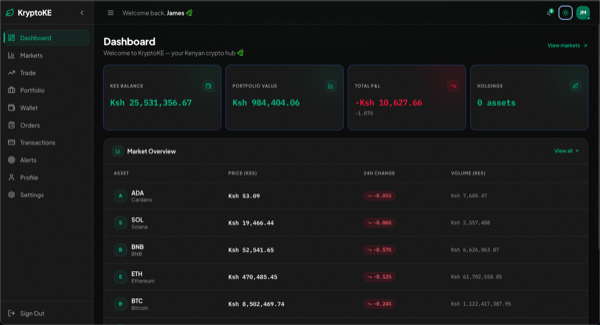
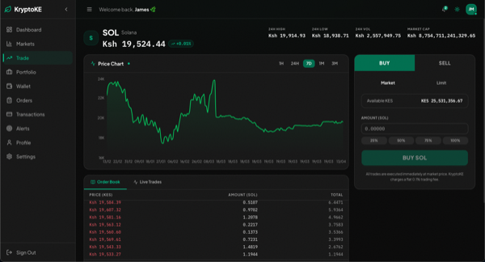
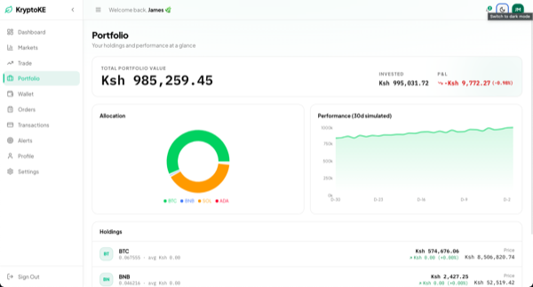
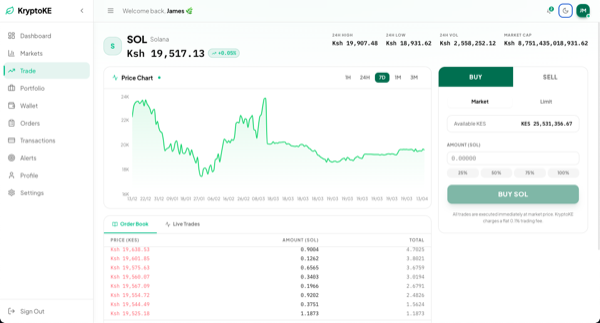

# KryptoKE

[](https://github.com/ToshGitonga0/kryptoke/actions)
[](LICENSE)
[](https://www.python.org/)
[](https://fastapi.tiangolo.com/)
[](https://nextjs.org/)
[](https://www.postgresql.org/)

> A full-stack crypto trading platform built for the Kenyan market — featuring real-time order matching, M-Pesa integration hooks, role-based access, and a live price simulator.

---

## Table of Contents

- [Screenshots](#screenshots)
- [Features](#features)
- [Prerequisites](#prerequisites)
- [Quick Start](#quick-start)
- [Default Seed Credentials](#default-seed-credentials)
- [Dev Runner](#dev-runner)
- [Tech Stack](#tech-stack)
- [Manual Setup](#manual-setup)
- [Project Structure](#project-structure)
- [Testing & Linting](#testing--linting)
- [Branching Workflow](#branching-workflow)
- [Contributing](#contributing)
- [License](#license)

---

## Screenshots

<table>
  <tr>
    <td align="center">
      <a href="docs/assets/screenshots/dashboard.png">
        
      </a>
      <br/><sub>Dashboard — portfolio overview & market snapshot</sub>
    </td>
    <td align="center">
      <a href="docs/assets/screenshots/dashboard-darkmode.png">
        
      </a>
      <br/><sub>Dashboard — dark mode</sub>
    </td>
  </tr>
  <tr>
    <td align="center">
      <a href="docs/assets/screenshots/portfolio.png">
        
      </a>
      <br/><sub>Portfolio — holdings and performance</sub>
    </td>
    <td align="center">
      <a href="docs/assets/screenshots/trade.png">
        
      </a>
      <br/><sub>Trade — place orders and view order book</sub>
    </td>
  </tr>
</table>

---

## Features

| Feature | Description |
|---|---|
| JWT Authentication | Secure email/password login with token refresh |
| Role-Based Access | Admin, staff, and customer roles with scoped permissions |
| Wallets | Deposits, withdrawals, and balance tracking per user |
| M-Pesa Integration | Hooks for Safaricom Daraja STK push and C2B payments |
| Order Matching | Buy/sell order engine with portfolio management |
| Price Simulator | Configurable real-time price feeds for demo and testing |
| Responsive UI | Mobile-first design with dark mode support |

---

## Prerequisites

Before you begin, make sure the following are installed and available on your `PATH`:

- [Git](https://git-scm.com/)
- [Python 3.11+](https://www.python.org/downloads/)
- [Node.js 18+ and npm](https://nodejs.org/)
- [PostgreSQL](https://www.postgresql.org/download/) — running locally
- [uv](https://github.com/astral-sh/uv) — fast Python dependency manager

---

## Quick Start

### Step 1 — One-time setup

Clone the repo and run the quickstart script from the repo root:

```bash
git clone https://github.com/ToshGitonga0/kryptoke.git
cd kryptoke
./scripts/quickstart.sh
```

The script will:

1. Verify all prerequisites
2. Prompt you for your PostgreSQL credentials and generate a `.env`
3. Create a Python virtual environment and sync dependencies with `uv`
4. Create the database if it doesn't exist
5. Run Alembic migrations
6. Seed the database with default users and crypto assets

You only need to run this once.

### Step 2 — Start the project

```bash
./scripts/dev.sh start
```

Then visit:

| Service | URL |
|---|---|
| Frontend | http://localhost:3000 |
| Backend API docs | http://localhost:8000/docs |

---

## Default Seed Credentials

| Role | Email | Password |
|---|---|---|
| admin | admin@kryptoke.co.ke | Admin@2024! |
| staff | staff@kryptoke.co.ke | Staff@2024! |
| customer | james.mwangi@gmail.com | Customer@2024! |
| customer | aisha.omar@gmail.com | Customer@2024! |
| customer | peter.njoroge@yahoo.com | Customer@2024! |
| customer | mercy.kamau@gmail.com | Customer@2024! |
| customer | brian.otieno@gmail.com | Customer@2024! |

> These credentials are for local development only. Never use them in production.

---

## Dev Runner

After the initial setup, use `dev.sh` for all day-to-day server management:

```bash
./scripts/dev.sh start              # start both servers
./scripts/dev.sh start backend      # start backend only
./scripts/dev.sh start frontend     # start frontend only
./scripts/dev.sh stop               # stop both servers
./scripts/dev.sh stop backend       # stop backend only
./scripts/dev.sh restart            # restart both servers
./scripts/dev.sh restart frontend   # restart frontend only
./scripts/dev.sh logs               # tail logs for both
./scripts/dev.sh logs backend       # tail backend log only
./scripts/dev.sh logs frontend      # tail frontend log only
```

> `stop` also kills any orphaned processes holding the configured ports, so stale processes from previous runs are always cleaned up.

Logs are written to:

```
logs/backend.log
logs/frontend.log
```

---

## Tech Stack

| Layer | Technology |
|---|---|
| Backend | Python 3.11, FastAPI, SQLModel, SQLAlchemy (async), Alembic |
| Frontend | Next.js 14, TypeScript, Tailwind CSS, Zustand, React Query |
| Database | PostgreSQL |
| Auth | JWT (python-jose), bcrypt |
| CI | GitHub Actions |

---

## Manual Setup

If you prefer full control over each step:

### Backend

```bash
cd backend
python -m venv .venv
source .venv/bin/activate
uv sync
cp .env.example .env        # edit DB_* and SECRET_KEY
alembic upgrade head
python seed.py
uvicorn app.main:app --reload --host 0.0.0.0 --port 8000
```

### Frontend

```bash
cd frontend
npm install
npm run dev
```

To override the API URL, create `frontend/.env.local`:

```env
NEXT_PUBLIC_API_URL=http://localhost:8000/api/v1
```

---

## Project Structure

```
kryptoke/
├── backend/
│   ├── app/
│   │   ├── api/          # Route handlers
│   │   ├── core/         # Config, security, dependencies
│   │   ├── models/       # SQLModel table definitions
│   │   ├── repos/        # database logic
│   │   └── services/     # Business logic
│   ├── alembic/          # Database migrations
│   ├── seed.py           # Database seeder
│   └── .env.example
├── frontend/
│   ├── app/              # Next.js app router pages
│   ├── components/       # Reusable UI components
│   ├── lib/              # API client, hooks, store
│   └── public/
├── scripts/
│   ├── quickstart-no-docker.sh
│   └── dev.sh
├── logs/
└── docs/
```

---

## Testing & Linting

**Backend — Ruff:**

```bash
cd backend
pip install ruff
ruff check .
```

**Frontend — ESLint:**

```bash
cd frontend
npm run lint
```
---

## Branching Workflow

Work on feature branches — never commit directly to `main`:

```bash
git checkout -b feat/your-feature
# make your changes and commit
git push -u origin HEAD
# open a pull request on GitHub
# merge after review
git checkout main && git pull origin main
```
---

## Contributing

See [CONTRIBUTING.md](CONTRIBUTING.md) for contribution guidelines, branch strategy, and code style expectations.

---

## License

MIT — see [LICENSE](LICENSE).
